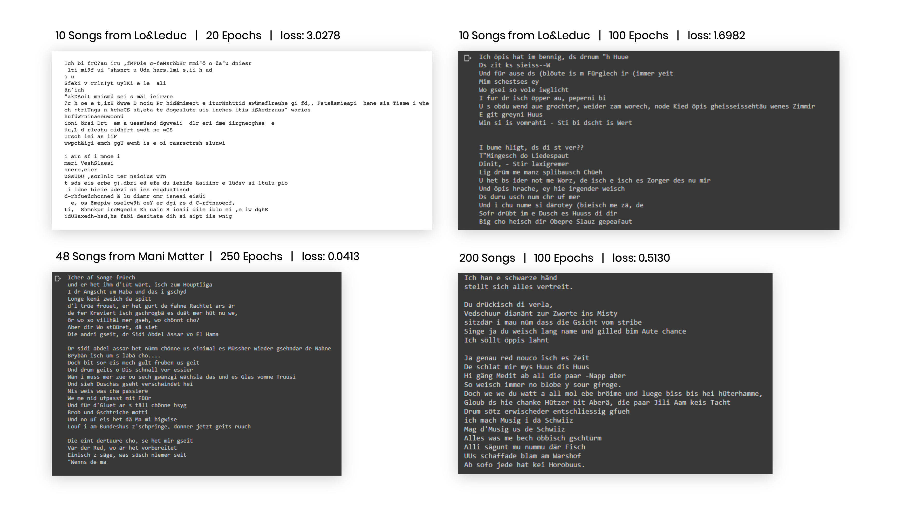

# Swiss Music Generator
This project was created in the course **Computational Perception extended COMPPX** from Chiara Kühne and Dominik Maag from the Digital Ideation at HSLU.

## Idea
Our idea was to train a model with Swiss dialect songs to generate our own Swiss song text. We were surprised how well the model copes with the different Swiss dialects and inconsistent spelling.

To make the result accessible to others, we have developed a frontend with which everyone can generate their own Swiss dialect song.

## Process
We have compiled a dataset of 200 Swiss dialect songs from [songtexte.com](https://www.songtexte.com/) from different artists in one txt file. With these we trained the ML5 CharRNN model. Before we used ML5 with the CharRnn we tried the Model from Tensorflow in different steps with more and more songs and different number of runs, how the result comes out, until we were satisfied.

**Training Progress**

Then we exported the trained model from the ML5 CharRNN in ML5.js. We used also a Colab-Notebook for this in which e set up the following Code, which is from the ML5 tutorial:

Befor running the Code we had to upload the git-reposetory from the Tutorial, which allowed us to use a model to train.

At the end we had our trained model which we integrate in our interfaco so we could generate song lyrics locally in a selfcreated frontend.

## Frontend
The Frondend is developed with HTML, CSS and JS. The user can typ a word in the input field and click "Text generieren". The generated text output will start with the entered word.

## Usage
You can download the files, open it with a local live server and generate your own songtext.

Screencast as a video:[`_Material/screencast.mp4`](_Material/screencast.mp4)

## References
* [Tensorflow Tutorial: Text generation with an RNN](https://www.tensorflow.org/text/tutorials/text_generation)
* [ML5 CharRNN](https://learn.ml5js.org/#/reference/charrnn)
